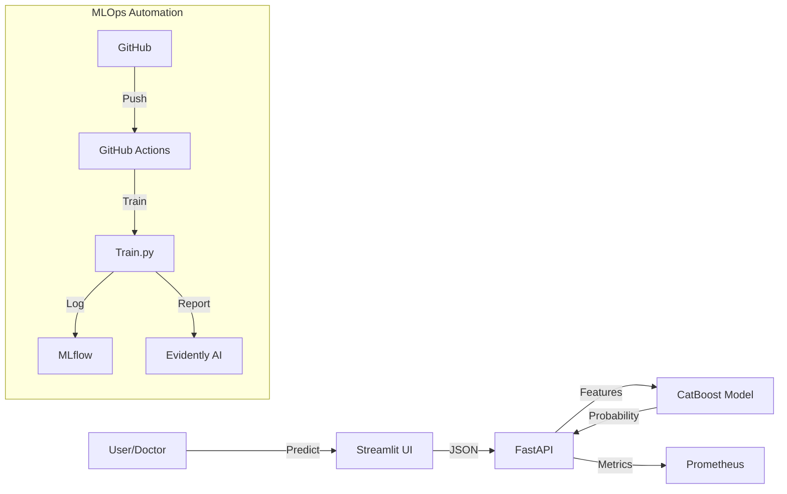

# 🧠 Medical Risk MLOps — Stroke Risk Prediction

[](https://www.python.org/downloads/release/python-3120/)
[](https://medicalriskmlops-gazdhmhjpne5angult4why.streamlit.app/)
[](https://www.docker.com/)
[](https://fastapi.tiangolo.com/)

An end-to-end **Enterprise MLOps** project for stroke risk prediction. This system demonstrates a complete machine learning lifecycle, from data processing to deployment, monitoring, and explainability.

---

## 📋 Table of Contents

- [Project Overview & Business Impact](#-project-overview--business-impact)
- [System Architecture](#-system-architecture)
- [Key Features](#-key-features)
- [Data Leakage Prevention](#-data-leakage-prevention)
- [Monitoring & Observability](#-monitoring--observability)
- [CI/CD Pipeline](#-cicd-pipeline)
- [Installation & Usage](#-installation--usage)
- [Model Performance](#-model-performance)
- [Limitations & Risks](#-limitations--risks)
- [Roadmap](#-roadmap)

---

## 🎯 Project Overview & Business Impact

This project provides a real-time risk assessment tool for stroke prediction based on **11 clinical features** (Age, BMI, Glucose, etc.).

### 💼 Business Impact

- **Early Intervention**: With a **Recall of 74%**, the system identifies the majority of high-risk patients, potentially saving lives through early warning.
- **Cost Reduction**: Preventing a single stroke event allows for significant healthcare cost savings compared to long-term rehabilitation care.
- **Efficiency**: Provides doctors with an immediate "second opinion" supported by **SHAP explanations**, reducing diagnostic time.

---

## 🏗 System Architecture

The system follows a microservices-ready architecture:



---

## ✨ Key Features

- **Model**: **CatBoost Classifier**, optimized for categorical data and class imbalance (`scale_pos_weight=20`).
- **Scaling**: `RobustScaler` for numerical features (Age, BMI, Glucose).
- **Explainability**: **SHAP** Waterfall plots explain _why_ a specific patient is high risk.
- **API**: **FastAPI** serves predictions with <50ms latency.
- **Frontend**: **Streamlit** dashboard with "Low/Moderate/High" risk visualizers.

---

## 🛡 Data Leakage Prevention

One of the most critical aspects of Medical ML is preventing **Data Leakage**. This project implements strict safeguards:

1.  **Duplicate Removal**: `load_data.py` automatically detects and removes duplicate rows **before** splitting, ensuring the same patient doesn't appear in both Train and Test sets.
2.  **Split-then-Scale**: Scaling (`RobustScaler`) is `fit` **only on the Training set** and then applied to the Test set. No statistics (mean/median) from the Test set leak into the model.
3.  **Row-Wise Feature Engineering**: All features (e.g., `Age Group`, `BMI Category`) are calculated per-patient, avoiding aggregate leakage.

---

## 📡 Monitoring & Observability

### 1. System Metrics (Prometheus)

Exposes `/metrics` for real-time operational monitoring:

- `http_requests_total`: Traffic volume.
- `http_request_duration_seconds`: API Latency.
- `http_requests_errors_total`: Error rates (5xx codes).

### 2. Data Drift (Evidently AI)

During training, the system compares the **New Training Data** vs **Reference Data**:

- **Metric**: Population Stability Index (PSI) and Wasserstein Distance.
- **Alert Condition**: If `Drift Score > 0.1` (p-value < 0.05) for critical features like `Age` or `Glucose`, a warning is logged in MLflow.
- **Artifact**: `data_quality_report.html` is generated for visual inspection.

---

## 🔄 CI/CD Pipeline

Automated with **GitHub Actions** (`mlops.yml`):

1.  **Environment Setup**: Installs Python 3.12 & dependencies.
2.  **Linting**: Checks code quality (flake8/black).
3.  **Unit Tests**:
    - `test_data.py`: Validates schema, checks for nulls.
    - `test_model.py`: Smoke test for the API (ensures `/predict` returns 200 OK).
4.  **Training Trigger**: (Optional) Can be configured to retrain model on new data push.
5.  **Artifact Management**: Saves trained models if tests pass.

---

## ⚙️ Installation & Usage

### Method 1: Local (Python 3.12)

```bash
# 1. Clone & Setup
git clone https://github.com/Mesutssmn/medical-risk-mlops.git
cd medical-risk-mlops
python -m venv .venv
.venv\Scripts\activate  # Windows

# 2. Install Dependencies
pip install -r requirements.txt

# 3. Running the App
streamlit run streamlit_app.py
```

### Method 2: Docker

```bash
docker-compose up -d
```

- **Streamlit**: http://localhost:8501
- **API**: http://localhost:8000
- **MLflow**: http://localhost:5000

---

## 📊 Model Performance

| Metric        | Value      | Description                                             |
| ------------- | ---------- | ------------------------------------------------------- |
| **ROC-AUC**   | **0.8485** | Strong discriminative ability.                          |
| **Recall**    | **0.7400** | Catches 74% of actual stroke cases (Priority Metric).   |
| **Precision** | **0.22**   | Accepting more False Positives to ensure higher Recall. |
| **Threshold** | **0.6904** | Optimized decision boundary.                            |

---

## ⚠️ Limitations & Risks

- **Dataset**: Based on the Kaggle Stroke Prediction dataset (Synthetic/Imbalanced). Distribution may not match real-world hospital data.
- **Clinical Validation**: This model is **NOT** clinically validated. It should be used as a decision support tool, not a replacement for medical diagnosis.
- **Bias**: The dataset has a strong correlation between "Age" and "Stroke", which may lead to underestimating risk in young patients with other comorbidities.

---

## 🔮 Roadmap

1.  **Database Integration**: Store request/response logs in PostgreSQL for Ground Truth analysis.
2.  **Advanced Alerting**: Connect Prometheus Alertmanager to Slack for drift notifications.
3.  **A/B Testing**: Implement Canary Deployment for model updates.
4.  **Security**: Add API Key authentication and Rate Limiting.

---

_Built with ❤️ by Mesut_
